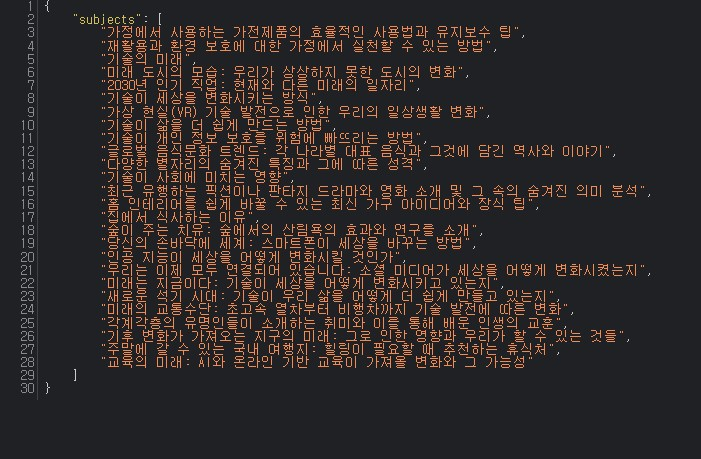
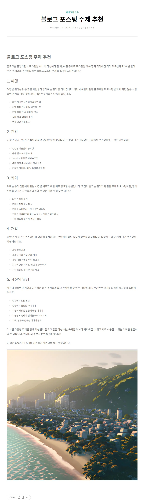

# howl-stupid-blog

ChatGPT API를 이용하여 멍청한 블로그를 만들어보자.

[https://nextdoorfire.tistory.com/](https://nextdoorfire.tistory.com/)

## 개발 환경

- Raspberry Pi 4 Model B Rev 1.2
- Debian GNU/Linux 11
- Python 3.9.2

## 사용한 APIs
- [OpenAI API](https://platform.openai.com/docs/introduction)
  - [Chat completion](https://platform.openai.com/docs/guides/chat)
  - [Image generation](https://platform.openai.com/docs/guides/images)
- [KAKAO Karlo API](https://developers.kakao.com/docs/latest/ko/karlo/common)

API 사용법은 [참고 문헌](#참고-문헌)에 있는 [블로그](https://wooiljeong.github.io/python/chatgpt-api/)에서 엄청 잘 설명해주고 있다.

## 기능


포스팅 할 주제를 적고 추가하기 버튼을 누르면 대기열에 추가된다.



목록 조회하기 버튼을 누르면 대기열 목록을 json으로 응답한다.

> INTERVAL을 기준으로 랜덤한 시간에 대기열에 있는 주제로 포스팅 내용을 만들고, 자동으로 포스팅한다.



주제를 가지고 ChatGPT를 이용하여 포스팅 내용을 만들고

이미지는 Karlo를 베이스로 하지만 Karlo에서 이미지 생성에 실패하면 DALL-E에서 생성한다.

## 티스토리 API 막힘(230520)

```
{'tistory': {'status': '403', 'error_message': '이 블로그는 내부 정책으로 OPEN API 사용할 수 없습니다.'}}
```

티스토리 API를 제한당했다.

깃헙블로그로 변경하려고 한다.

### 참고 문헌
- https://wooiljeong.github.io/python/chatgpt-api/